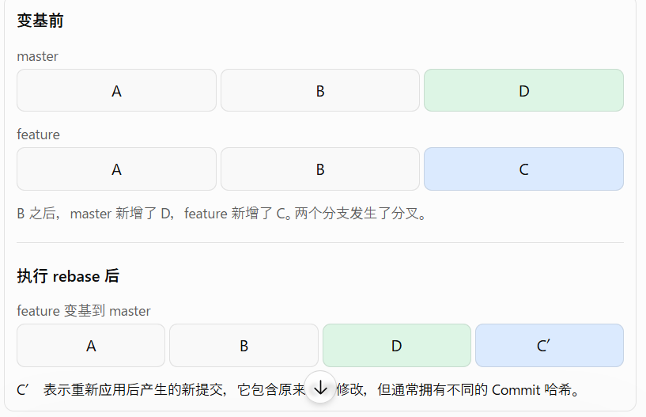

# Git 的四个位置
工作区、暂存区和本地仓库都在开发者自己的电脑上；远程仓库通常位于 GitHub、GitLab 或公司的 Git 服务器上。

# 为什么需要 Staging Area（暂存区）
Git 不希望你“改了什么就全部提交什么”，而是希望你先挑选：这一次 commit 到底要包含哪些修改。git add 决定“下一次 commit 要提交什么”。
```
┌──────────┐
│  工作区   │  ← 我正在修改什么
└────┬─────┘
     │ git add
     ↓
┌──────────┐
│  暂存区   │  ← 我这次准备提交什么
└────┬─────┘
     │ git commit
     ↓
┌──────────┐
│ 本地仓库  │  ← 已经形成 commit
└────┬─────┘
     │ git push
     ↓
┌──────────┐
│ 远程仓库  │  ← GitHub
└──────────┘
```

# git diff
git diff ：查看“两个版本之间到底改了什么”。`工作区  ←→  暂存区`   
git diff --staged：Staging Area 与当前 Commit 之间准备提交的差异。  

# git diff HEAD
比较当前工作区中的文件与最近一次提交（HEAD）之间的差异。

# git status
查看当前 Git 仓库现在处于什么状态，以及哪些文件发生了变化。
```
C:\Users\compu\Downloads\mygithub\git_test>git status
On branch master

No commits yet

Changes to be committed:
  (use "git rm --cached <file>..." to unstage)
        new file:   123.txt

Changes not staged for commit:
  (use "git add <file>..." to update what will be committed)
  (use "git restore <file>..." to discard changes in working directory)
        modified:   123.txt
```

# Commit Message
Commit Message 就是填写本次 Git 提交的说明，用来记录你这次修改了什么。

# git log
确认历史

# git show HEAD
HEAD 表示当前所在的 Commit。显示该 Commit 的作者、时间、说明和完整差异。

# .gitignore
哪些文件不应纳入版本管理

# git分支branch
`git switch -c feature`相当于执行了以下两句:  
`git branch feature`:创建名为 feature 的分支。  
`git switch feature`:切换到 feature 分支。  

# git merge 分支
合并分支  
## git merge --abort
取消本次合并

# Conflict
如果两个 Branch 修改了同一位置，而且 Git 无法自动判断最终结果，就会发生 Conflict（冲突）
```
C:\Users\compu\Downloads\mygithub\git_test>git merge feature
Auto-merging 123.txt
CONFLICT (content): Merge conflict in 123.txt
Automatic merge failed; fix conflicts and then commit the result.
```
在123.txt文件中
```
<<<<<<< HEAD
=======
123
234
>>>>>>> feature
Hello Git Branch
This is a new change in feature
```
Merge 停止后先确认状态`git status`

# origin 是什么
在 Git 中，origin 通常是远程仓库的默认别名，一般指向你在 GitHub 上的仓库地址。

# git remote -v
git remote -v 用来查看当前本地 Git 仓库配置了哪些远程仓库，以及它们对应的网址。
```
C:\Users\compu\Downloads\mygithub\git_test>git remote -v
origin  https://github.com/firstplaye/git-test.git (fetch)
origin  https://github.com/firstplaye/git-test.git (push)
```
# git pull
git pull 的作用是：从远程仓库获取最新的提交，并将这些更新合并到当前本地分支。
# git push
把本地 Commit 发送到服务器
# git clone
把远程 Git 仓库完整地复制一份到本地电脑，通常用于第一次获取一个 GitHub 项目。
# PR/MR是什么
PR/MR 就是向团队申请把自己写好的代码合并到另一个分支，请其他人检查后再合并。
## CI 是什么？
让机器自动验证代码，而不是只依赖开发者手动测试。
## Merge Gate 是什么？
Merge Gate 可以理解为合并门禁，即在 PR/MR 合并之前必须满足的一组条件。例如：CI 构建必须成功。所有测试必须通过。至少一位同事批准代码审查。不能存在未解决的讨论。不能存在合并冲突。

```

1

收到 Ticket

明确开发任务

2

创建 feature 分支

隔离本次代码修改

3

提交并推送代码

git commit → git push

4

创建 PR / MR

申请合并到 develop

5

CI 自动检查

构建、测试、代码规范

6

检查 Merge Gate

检查状态、审批和冲突

7

合并代码

条件满足后合并
```

# 怎么确认当前branch
方法一：git branch  
方法二：git status  

# Tag是什么
Git 中的 Tag（标签），可以理解为给某一个特定的 Commit 打上一个固定的标记，通常用来标记软件的版本发布。

## tag和branch的区别是什么
Branch（分支）：用于开发新功能。随着你不断提交 Commit，分支指向的位置会不断向前移动。  
Tag（标签）: 用于标记某个重要的 Commit，例如发布版本。标签通常不会随着后续提交自动移动。  

# restore
Git 中的 restore 是恢复文件状态的命令，主要用于撤销文件的修改。
## 三种用法
### ① git restore 文件名
丢弃工作区的修改，恢复为暂存区中的版本；如果文件没有被暂存过，通常就恢复为最近一次 Commit 中的版本。
### ② git restore --staged 文件名
取消暂存，但保留文件修改。
### ③ git restore --source=HEAD 文件名
将文件恢复为当前分支最近一次 Commit 的版本。

# stash
把当前还没提交的修改暂时收起来，等以后再恢复。比如你正在开发休假申请功能，123.txt 改到一半，突然需要切换到另一个分支修复 Bug。这时不想提交半成品，也不想丢掉修改，就可以使用 git stash。

# cherry-pick
从另一个分支中挑选某一个 Commit，把它的修改应用到当前分支。它特别适合这种情况：另一个分支上有一个你需要的 Bug 修复，但你不想把整个分支合并过来。选取指定的提交

# rebase
Git 中的 rebase（变基）可以理解为：把当前分支上的提交，重新接到另一个分支的最新提交后面，让提交历史更整齐。