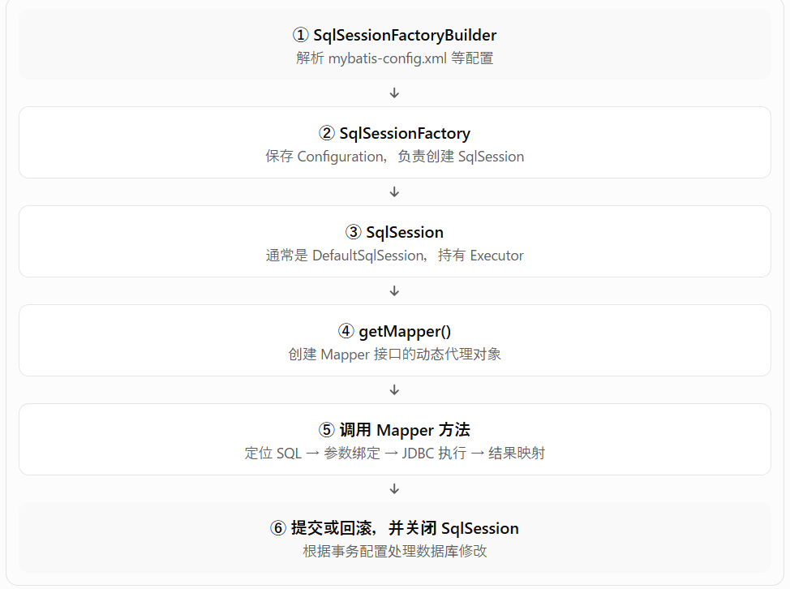
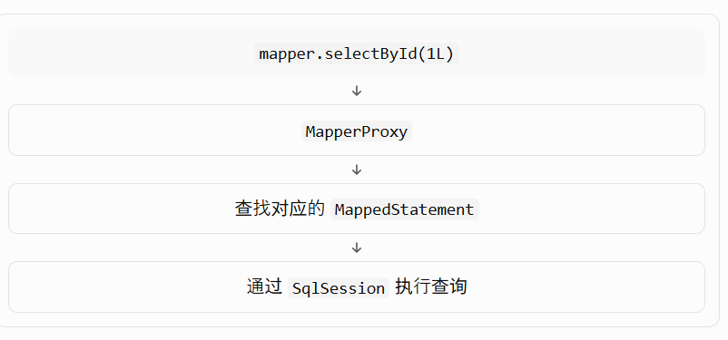

# 什么是 MyBatis？
MyBatis 是一款优秀的持久层框架，它支持自定义 SQL、存储过程以及高级映射。

# Maven依赖
Maven 依赖 = 在 pom.xml 告诉 Maven：“我的项目需要这个第三方库”，Maven 再负责下载、放到 Classpath，并处理它的相关依赖。

# MyBatis 从启动配置到执行 SQL，再到关闭会话的完整流程

## 步骤（1）：获取 SqlSessionFactory 对象
解析 mybatis-config.xml 等配置
## 步骤（2）：获取 SqlSession 对象
SqlSessionFactory 是工厂，负责创建会话。
SqlSession 是一次数据库操作的会话入口。
## 步骤（3）：获取 Mapper 接口的代理对象
```
EmployeeMapper mapper =
    session.getMapper(EmployeeMapper.class);
```
这是 MyBatis 非常重要的机制：动态代理。
### 为什么 Mapper 接口没有实现类，却可以调用？
因为 MyBatis 会通过 MapperProxyFactory 等组件创建 Mapper 接口的代理对象。你调用接口方法时，实际进入的是代理对象的调用处理逻辑。

## 步骤（4）：执行增删改查方法
增删改需要commit后才会真正作用在数据库上  
## 步骤（5）：关闭会话
```
try (SqlSession session = factory.openSession()) {

    EmployeeMapper mapper =
        session.getMapper(EmployeeMapper.class);

    Employee employee = mapper.selectById(1L);

    System.out.println(employee);
}
```
try-with-resources 会在代码块结束时自动调用 close()。

# settings 常用 name 属性
`<setting name="mapUnderscoreToCamelCase" value="true"/>`  
`mapUnderscoreToCamelCase`表示下划线字段自动映射为驼峰属性。

# typeAliases
类型别名可以简化 XML 中的 Java 类名。
```
<typeAliases>
    <typeAlias type="com.example.mybatis.entity.Employee" alias="Employee"/>
</typeAliases>
```

# Mapper 是什么
Mapper 就是 MyBatis 中连接“Java 方法”和“SQL”的桥梁。

# 四个核心对象SqlSessionFactoryBuilder,SqlSessionFactory,SqlSession,Mapper 代理对象
SqlSessionFactoryBuilder:用来创建 SqlSessionFactory 的。  
SqlSessionFactory:创建 SqlSession 的工厂。  
SqlSession:一次数据库操作的“工作会话”。  
Mapper 代理对象:MyBatis 会动态生成一个 Mapper 接口的代理对象。把 Mapper 方法映射到 SQL。  

# resultMap
resultMap 用于明确指定列和属性的映射关系。当数据库列名和 Java 属性名不一致，或者查询结果比较复杂时，推荐使用 resultMap。
```
<resultMap id="detailedBlogResultMap" type="Blog">//id="映射规则名称" type="Java类型"
  <constructor>//<constructor>用于在实例化类时，注入结果到构造方法中
    <idArg column="blog_id" javaType="int"/>//<idArg>构造方法中的参数是对象的 ID / 主键。<arg>构造方法中的普通参数。
  </constructor>
  <result property="title" column="blog_title"/>
  <association property="author" javaType="Author">//<association> 用于映射一个对象属性。
    <id property="id" column="author_id"/>//<id>映射主键列,property:Java对象属性名,column:数据库查询结果列名
    <result property="username" column="author_username"/>
    <result property="password" column="author_password"/>
    <result property="email" column="author_email"/>
    <result property="bio" column="author_bio"/>
    <result property="favouriteSection" column="author_favourite_section"/>
  </association>
  <collection property="posts" ofType="Post">//property 表示集合属性名。ofType 表示集合中每个元素的类型。
    <id property="id" column="post_id"/>
    <result property="subject" column="post_subject"/>
    <association property="author" javaType="Author"/>
    <collection property="comments" ofType="Comment">
      <id property="id" column="comment_id"/>
    </collection>
    <collection property="tags" ofType="Tag" >
      <id property="id" column="tag_id"/>
    </collection>
    <discriminator javaType="int" column="draft">
      <case value="1" resultType="DraftPost"/>
    </discriminator>
  </collection>
</resultMap>
```

# @Param
让你在 Mapper XML 的 SQL 里，可以明确地通过名字引用 Java 方法参数。多参数建议使用 @Param 明确命名。
```
import org.apache.ibatis.annotations.Param;

List<Employee> selectByDepartmentAndName(
        @Param("departmentId") Long departmentId,
        @Param("name") String name
);
```

# #{} 和 ${} 的区别
#{} 用来传“值”，${} 用来直接拼接“SQL 片段”。

## #{}：安全地传入参数值
```
<select id="selectById" resultType="Employee">
    SELECT *
    FROM employees
    WHERE id = #{id}
</select>
```
MyBatis 最终会准备类似：
```
SELECT *
FROM employees
WHERE id = ?
```
## ${}：直接把内容拼进 SQL
```
<select id="selectByOrder">
    SELECT *
    FROM employees
    ORDER BY ${column}
</select>
```
MyBatis 最终可能直接变成：
```
SELECT *
FROM employees
ORDER BY salary
```

# 动态sql
## if
```
<select id="findActiveBlogLike"
     resultType="Blog">
  SELECT * FROM BLOG WHERE state = ‘ACTIVE’
  <if test="title != null">
    AND title like #{title}
  </if>
  <if test="author != null and author.name != null">
    AND author_name like #{author.name}
  </if>
</select>
```
## choose、when、otherwise
有时候，我们不想使用所有的条件，而只是想从多个条件中选择一个使用。针对这种情况，MyBatis 提供了 choose 元素，它有点像 Java 中的 switch 语句。
```
<select id="findActiveBlogLike"
     resultType="Blog">
  SELECT * FROM BLOG WHERE state = ‘ACTIVE’
  <choose>
    <when test="title != null">
      AND title like #{title}
    </when>
    <when test="author != null and author.name != null">
      AND author_name like #{author.name}
    </when>
    <otherwise>
      AND featured = 1
    </otherwise>
  </choose>
</select>
```
## where
where 元素只会在子元素返回任何内容的情况下才插入 “WHERE” 子句。而且，若子句的开头为 “AND” 或 “OR”，where 元素也会将它们去除。
```
<select id="findActiveBlogLike"
     resultType="Blog">
  SELECT * FROM BLOG
  <where>
    <if test="state != null">
         state = #{state}
    </if>
    <if test="title != null">
        AND title like #{title}
    </if>
    <if test="author != null and author.name != null">
        AND author_name like #{author.name}
    </if>
  </where>
</select>
```
## set
用于动态更新语句的类似解决方案叫做 set。set 元素可以用于动态包含需要更新的列，忽略其它不更新的列。set 元素会动态地在行首插入 SET 关键字，并会删掉额外的逗号（这些逗号是在使用条件语句给列赋值时引入的） 
```
<update id="updateAuthorIfNecessary">
  update Author
    <set>
      <if test="username != null">username=#{username},</if>
      <if test="password != null">password=#{password},</if>
      <if test="email != null">email=#{email},</if>
      <if test="bio != null">bio=#{bio}</if>
    </set>
  where id=#{id}
</update>
```
## foreach
`<foreach>` 常用于 IN 查询。
```
<select id="selectByIds" resultType="Employee">
    SELECT id, name, department_id AS departmentId, email
    FROM employees
    WHERE id IN
    <foreach collection="ids" item="id" open="(" separator="," close=")">
        #{id}
    </foreach>
</select>
```
collection:集合参数名  
item:每次循环的变量名
open:开始符号
separator:分隔符
close:结束符号
# sql
`<sql>` 用于定义可以重复使用的 SQL 片段。`<sql>` 本身不会单独执行，需要配合 `<include>` 引用。
```
<sql id="employeeColumns">
    id,
    name,
    department_id AS departmentId,
    email
</sql>
<select id="selectAll" resultType="Employee">
    SELECT
    <include refid="employeeColumns" />
    FROM employees
</select>
```
# MyBatis 缓存机制
第一次查数据库后，把查询结果暂时保存起来；之后再查相同的数据，可以直接从缓存拿，减少数据库访问。  
一级缓存:SqlSession 级别  
二级缓存:Mapper / namespace 级别  
## 什么情况下一级缓存会失效？
SqlSession 被关闭,执行更新、插入、删除,手动清理(sqlSession.clearCache()),
## 二级缓存的范围比一级缓存大。
不同的 SqlSession 可以共享。
```
SqlSession session1 = ...
EmployeeMapper mapper1 =
        session1.getMapper(EmployeeMapper.class);

mapper1.selectById(1L);

session1.close();
SqlSession session2 = ...
EmployeeMapper mapper2 =
        session2.getMapper(EmployeeMapper.class);

mapper2.selectById(1L);
```
## 为什么需要两级缓存？
一级缓存:同一个 SqlSession 内重复查询  
二级缓存:不同 SqlSession 之间共享查询结果
## 缓存会出现什么问题
### 数据什么时候失效？
假设缓存里：
```
Employee id=1
name = Tanaka
```
数据库后来变成：
```
name = Suzuki
```
如果缓存没有及时清理：你拿到的可能还是旧数据。**缓存脏数据 / 数据一致性问题**

# N+1查询
先查询 1 次主表，得到 N 条数据，然后为了这些 N 条数据的关联数据，又分别查询 N 次。最终执行了 1 + N 次 SQL。
```
<resultMap id="departmentWithEmployeesNestedMap"
           type="Department">
    <id property="id" column="id"/>
    <result property="name" column="name"/>
    <collection property="employees"
                ofType="Employee"
                column="id"
                select="com.example.mybatis.mapper.EmployeeMapper.selectByDepartmentId"/>
</resultMap>

<select id="selectAllWithEmployees"
        resultMap="departmentWithEmployeesNestedMap">
    SELECT id, name
    FROM departments
    ORDER BY id
</select>
```
## 解决方法
### 方法一：使用 JOIN 一次查询
```
SELECT
    d.id AS department_id,
    d.name AS department_name,
    e.id AS employee_id,
    e.name AS employee_name
FROM departments d
LEFT JOIN employees e
    ON e.department_id = d.id
ORDER BY d.id, e.id;
```
### 方法二：先查部门，再批量查询员工
先查询所有部门，再用一条带 IN 条件的 SQL 查询这些部门的员工，最后在 Java 中按照 departmentId 分组。

# 循环执行 INSERT / UPDATE
假设你要新增 100 名员工：
```
@Transactional
public void saveEmployees(List<Employee> employees) {
    for (Employee employee : employees) {
        employeeMapper.insert(employee);
    }
}
```
这里有两个独立的问题：  
```
事务问题： 如果中途发生异常，整批数据是否回滚？
性能问题： 100 次 Mapper 调用是否逐次执行 SQL？
```
